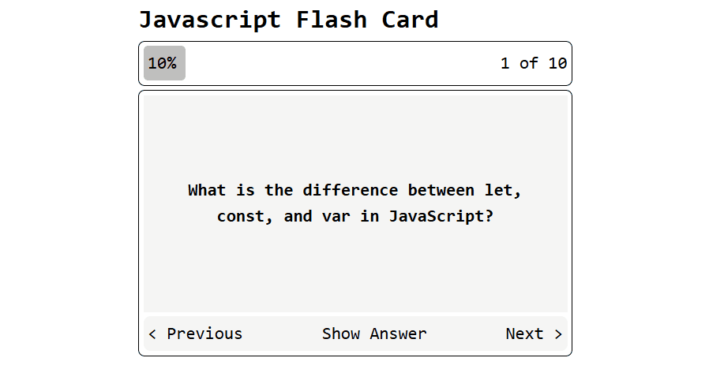

# JavaScript Flash Card

A simple flash card application built with React, TypeScript, and Tailwind CSS to help users learn JavaScript concepts through interactive question-and-answer cards.

## 🎥 Demo

## 🚀 Features

- Browse JavaScript questions one by one
- Show or hide answers
- Previous and Next navigation
- Progress bar with percentage indicator
- Responsive layout
- Smooth transitions and animations

## 🛠️ Built With

- React
- TypeScript
- Tailwind CSS
- Vite

## 📖 How It Works

The application stores a collection of JavaScript questions and answers in an array. Users can navigate through the cards, reveal answers when needed, and track their learning progress using the progress bar.
